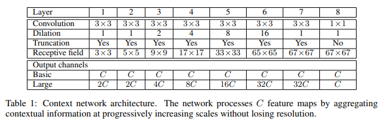

# Dilation Implementation with Pytorch


## 0. Develop Environment
```
Docker Image
- tensorflow/tensorflow:tensorflow:2.4.0-gpu-jupyter

Library
- Pytorch : Stable (1.7.1) - Linux - Python - CUDA (11.0)
```
- Using Single GPU (not tested on cpu only)


## 1. Explain about Implementation


## 2. Brief Summary of *'Multi-Scale Context Aggregation by Dilated Convolutions'*

### 2.1. Goal
- Improve performance of semantic segmentation

### 2.2. Intuition
- Front-end module : prevent severe intermediate downsampling
- Context module : respond to multi-scale resolution images

### 2.3. Evaluation Metric
- Mean intersection over union

### 2.4. Front-end Module
- DCNN : modified VGG-16
  * Remove the last 2 pooling and striding layers
  * Convolutions in all subsequent layers were dilated by a factor of 2 for each pooling layer that was ablated
  * Convolutions in the final layers, which follow both ablated pooling layers, are dilated by a factor of 4
  * Remove padding of the intermediate feature maps

### 2.5. Context Module


### 2.6. Training on PASCAL VOC 2012
- 2-stage training
  * VOC 2012 + Microsoft COCO : lr 0.001 (100K iteration), lr 0.0001 (40K iteration)
  * VOC 2012 : lr 0.00001 (50K iteration)
- Train Details
  * minibatch SGD with momentum
    * batch size : 14
    * momentum : 0.9
    * weight decay : 0.0005


## 3. Reference Paper
- Multi-Scale Context Aggregation by Dilated Convolutions [[paper]](https://arxiv.org/pdf/1511.07122.pdf)
- Original Dilation Implementation with Caffe [[github]](https://github.com/fyu/dilation)
